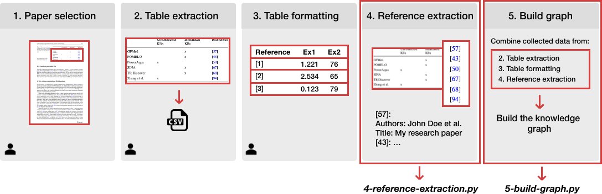

# Survey table importer
Part of paper *Creating a Scholarly Knowledge Graph from Survey Articles*

This repository contains the scripts required to build a knowledge graph from scientific survey tables. In the image below, the methodology is depicted. The two Python scripts `4_reference_extraction.py` and `5_build_graph.py` are needed for step 4 and 5 respectively. This repository only involves the last two steps. 

## Requirements 
* Python 3.6 or newer
* GROBID must be running (see: https://grobid.readthedocs.io/en/latest/Install-Grobid/)

## Installation 
* Run `pip install -r requirements.txt`
* Ensure the settings in the `default.env` file are correct and run `cp default.env .env`
* Make a folder `./data` and put the table CSV and the PDF file in there. Make sure the CSV and PDF file have the same name (e.g., `paper1.csv` and `paper1.pdf`). It is possible to add multiple papers to the same folder. 

## Running
### Add references
* Run `python 4_reference_extraction.py` 
* *Optionally provide a different data directory, by passing `--dir`  (default: './data')*

### Build graph
*This script specifically focuses on building a graph with the ORKG API*
* Make sure a settings file is created, listing the metadata needed to create a comparison. See the file `tables.csv` for an example
* Run `python 5_build_graph.py`
* *Optionally provide a different data directory, by passing `--dir` (default: './data')*
* *Optionally provide a different settings file directory, by passing `--settings` (default: './tables.csv')*

## Utils
Two utility scripts are provided:
* `utils_get_all_inserted_papers.py` gets the full list of inserted papers based on the comparison IDs 
* `utils_get_duplicate_papers.py` is used for quality control. This script finds papers from the CSVs that have the same title but different citation keys (which is an indication that the reference extraction went wrong)